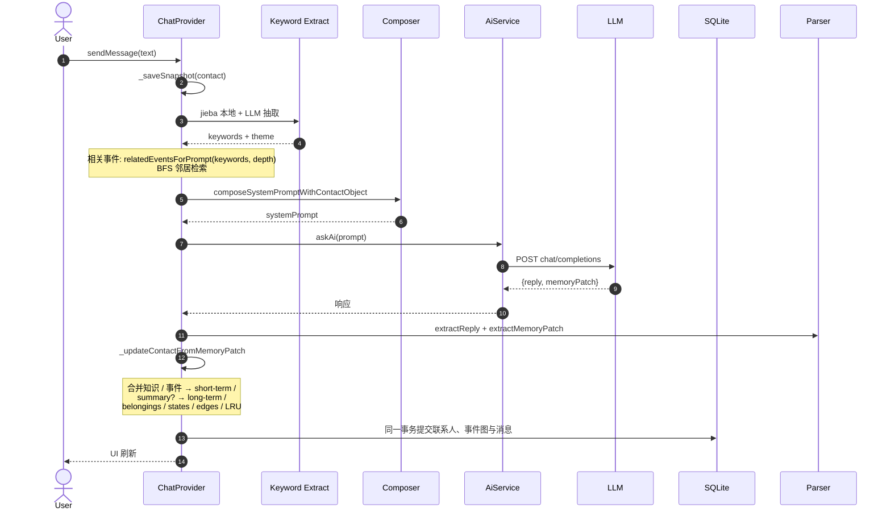
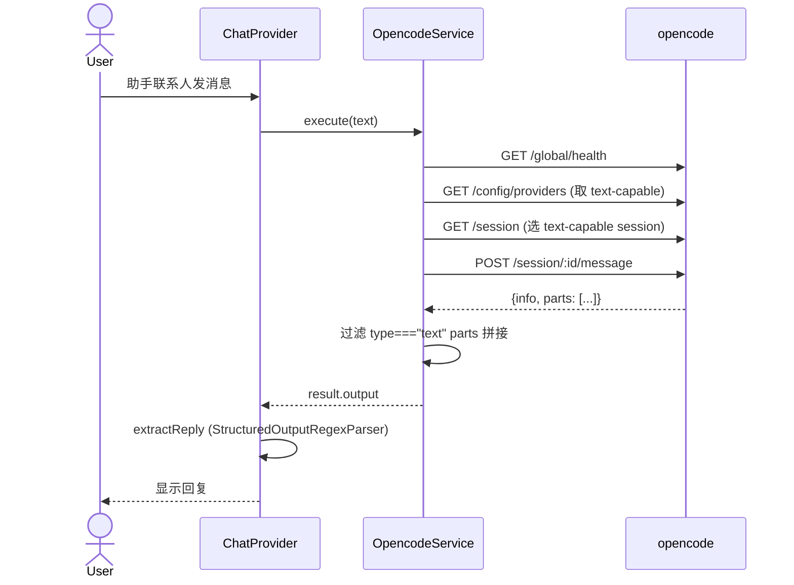

# AI 角色扮演对话应用

> 基于 Flutter 的本地 AI 角色/故事对话应用：长期记忆、关键词召回 + 事件图 BFS、三级级联、opencode 助手桥接。

[](.) [](.) [](.)

---

## 项目定位

单设备离线优先的 AI 角色扮演 App。LLM 调用走 HTTP（自配 base URL + API Key），长期记忆存在本地。**不上云、不上传联系人数据。**

> 📐 想看完整架构与数据流图：见 [docs/architecture.html](docs/architecture.html)（含 mermaid 流程图、状态机、数据存储布局、参数对照表）。

## 三种联系人

| 类型 | category | 引擎 | 走哪条路径 |
|---|---|---|---|
| **角色** | `ContactCategory.contact` | LLM + 结构化记忆 | `sendMessage` → `AiService` → 事件图 |
| **故事** | `ContactCategory.story` | LLM + 结构化记忆（schema 略不同） | 同上，`_buildJsonFormat(isStory: true)` |
| **助手** | `ContactCategory.assistant` | opencode 桥接 | `_sendAssistantMessage` → `OpencodeService` |

## 核心能力

- **三级记忆级联**：短期（10）→ 长期（5）→ 超长期（2），阈值触发 + LLM 压缩，详见 [架构图](docs/architecture.html#三级记忆短期--长期--超长期)
- **关键词召回 + 事件图 BFS**：本地 jieba + LLM 抽取关键词做关键词命中；`relatedEventsForPrompt` 在事件图上按关键词 + 边做 BFS 邻居检索（深度由 `searchDepth` 控制）。两条召回结果合并去重后进入 prompt 的"联想内容"段
- **事件间边关系**：LLM 通过 `relatedEventIds` 声明强关联，**硬上限 2 个**；LRU 排序按关键词 + 邻居 + 物品/设定 关联权重综合打分
- **三种创建方式**：表单 / JSON 导入 / 自然语言描述（LLM 转 JSON）
- **撤回最近一轮**：基于 snapshot，可恢复消息列表 + 联系人
- **流式输出与停止**：OpenAI 兼容 SSE 流式回复逐块显示；流式/非流式请求均可立即停止并保留明确状态
- **消息操作与候选回复**：支持复制、引用、编辑、删除，以及为任意消息生成、保存和切换候选回复
- **停止与安全重生成**：可修改上一轮输入，在完整撤回旧回复和旧记忆后重新生成
- **会话搜索与用量估算**：搜索完整会话历史、预览上下文，并估算当前窗口 Token 与费用
- **多 LLM Profile**：可保存多个 Profile、快速切换、批量健康检查，并在主 Profile 失败时自动 fallback
- **可视化记忆档案**：三标签页（列表/时间线/召回调试），按层级和状态筛选，关键词搜索，来源对话追踪，每条记忆的事件关系边和邻居节点可视化，完整召回调试信息展示
- **世界书系统**：地点、组织、规则、时间线事件的独立管理，四标签页 UI，自动注入 LLM Prompt 作为角色行为参考
- **图片画廊与缓存**：生图自动缓存到本地文件系统，LRU 淘汰；网格画廊支持角色筛选、全屏预览；角色外观一致性算法（特征签名 + 种子锁定 + 参考图）确保同一角色图片风格一致
- **TTS 音色与播放**：联系人编辑页可试听音色，聊天消息可拉取真实音频并通过系统媒体播放器播放/停止
- **SQLite 本地数据库**：联系人、消息、三级事件、边和关系队列规范化存储，一轮对话原子提交
- **万级消息分页**：启动只载入当前会话最近 100 条，可向前加载；完整备份仍包含全部历史
- **剧情检查点与分支**：成功轮次自动建立可逆检查点，可从历史回复创建、切换、重命名和备份剧情分支
- **完整本地备份**：版本化 JSON 备份角色、消息和事件图；恢复不会覆盖 API、模型和应用设置
- **调试模式**：显示完整 prompt + 关键词提取结果
- **应用设置**：20 项可调（详见 [应用设置](#应用设置)）

## 项目结构

```
lib/
├── main.dart, app.dart              # 入口
├── features/
│   ├── chat/
│   │   ├── domain/
│   │   │   ├── providers/chat_provider.dart     # 页面状态与用例编排
│   │   │   ├── repositories/chat_persistence.dart
│   │   │   └── services/                        # 记忆、召回、修订、角色/故事策略
│   │   ├── data/
│   │   │   ├── models/{contact,message}.dart    # 联系人（含 eventGraph、worldBook）、消息
│   │   │   ├── repositories/chat_repository.dart
│   │   │   └── datasources/                     # SQLite 主存储 + 旧数据只读迁移源
│   │   └── presentation/
│   │       ├── pages/chat_page.dart              # 主聊天界面
│   │       └── widgets/{contact_sidebar,contact_editor_dialog}.dart
│   └── worldbook/
│       ├── domain/entities/                      # WorldLocation, WorldOrganization, WorldRule, WorldTimelineEvent
│       ├── domain/services/                      # WorldBookService（CRUD + 搜索）
│       └── presentation/pages/                   # 世界书四标签页 UI
│   └── media/
│       ├── domain/services/                      # ImageCacheService（本地缓存 + LRU 淘汰）
│       └── presentation/pages/                   # 图片画廊（网格 + 全屏预览）
├── core/
│   ├── constants/{api_constants,app_strings}.dart
│   ├── data/models/app_settings.dart
│   ├── presentation/pages/{app_settings,assistant_config}_page.dart
│   └── utils/
│       ├── structured_input_prompt_composer.dart  # prompt 拼接
│       ├── structured_output_regex_parser.dart    # JSON 解析
│       └── chinese_tokenizer_service.dart          # jieba
└── infrastructure/services/
    ├── ai_service.dart        # LLM HTTP 客户端
    └── opencode_service.dart  # opencode REST 客户端
```

## 数据流（角色对话，单轮）



## 三级记忆（1→2 与 2→3 级联）

- **1→2** 触发：短期 un-summarized ≥ `summaryThreshold`（默认 10）
  - LLM 强制输出 `summary`，进入长期 un-summarized
  - 旧 brief 搬入长期、标 summarized
- **2→3** 触发：长期 un-summarized ≥ `ultraSummaryThreshold`（默认 5），**仅在 1→2 未触发时**
  - 同样 LLM 输出 `summary`，进入超长期 un-summarized
  - 旧长期 entry 搬入超长期、标 summarized
- LLM 也可在场景/话题结束时**自主**输出 summary（不强制时）
- 调 `ultraSummaryThreshold = 999` 即禁用 2→3

> LLM 输出 summary 的提示词在 `_buildRules(mustSummarize: ...)` 区分强制 vs 自主。

## 边关系

LLM 在 `memoryPatch.relatedEventIds` 里声明与本次事件强相关的往期事件编号：

- **硬上限 2 个**，重复边去重
- 提示词里强调：宁缺毋滥，不要连环关联
- 用于建立事件间边图，LRU 评分时会按 `lruEventEventWeight`（默认 50）给邻居事件加成

## 助手（opencode）

不走 LLM，直接 HTTP 调 PC 上跑的 `opencode serve`（默认 :4096）：



**关键点**：
- 选模型/session 时**过滤 TTS / 纯 audio 模型**（`capabilities.output.text !== false` 且 id/name 不含 `tts`）
- LLM 响应结构和角色相同（`{reply, memoryPatch}`），按 `extractReply` 取 `reply` 字段
- 缓存 `sessionId` 持久化，复用同一会话
- Android 9+ 走明文 HTTP 需 `network_security_config.xml`（已配）

### opencode 声明与致谢

本项目的助手桥接、远程执行与会话复用等部分功能基于 opencode 的服务接口与开发体验进行适配和开发。感谢 opencode 项目及其社区提供的开放工具与启发。

本项目是独立开发的 AI 角色/故事对话应用，与 opencode 项目及其维护者不存在从属、隶属、官方合作或背书关系；项目中的 opencode 相关能力仅作为可选桥接功能使用。

## 远程连接 PC 上的 opencode

| 方式 | PC 端 | 安卓端配置 | 优缺点 |
|---|---|---|---|
| **Tailscale** | 装 Tailscale，登录同账号 | host=100.x.x.x, port=4096, http | 一次配好长期稳定，4G/5G/Wi-Fi 都通 |
| **Cloudflare Tunnel** | `cloudflared tunnel --url http://localhost:4096` | host=trycloudflare.com, port=443, https ✓ | 零配置，URL 每次启动会变 |
| **VPS SSH 反代** | `ssh -R 14096:127.0.0.1:4096 user@vps` | host=VPS 公网 IP, port=14096, http | 灵活但 VPS 自身是攻击面 |

> PC 启动：`opencode serve --hostname 0.0.0.0 --port 4096`（建议 `export OPENCODE_SERVER_PASSWORD=xxx`）

## 应用设置

应用设置页（右上角齿轮）共 20 项，分 6 组：

| 分组 | 设置 | 默认 | 范围 |
|---|---|---|---|
| **LLM 输入限制** | maxShortTermEvents | 10 | 1-50 |
| | maxLongTermEvents | 1 | 1-30（默认只取最新 summary；老 summary 走 2→3 进超长期） |
| | maxUltraTermEvents | 2 | 1-20 |
| | maxRelatedEvents | 5 | 1-20 |
| **本地存储限制** | maxShortQueue | 2000 | 100-10000 |
| | maxLongQueue | 500 | 50-5000 |
| | maxUltraQueue | 200 | 20-2000 |
| **Prompt 限制** | maxPromptListItems | 5 | 1-20 |
| | maxPromptLineLength | 200 | 50-1000 |
| **事件处理** | summaryThreshold | 10 | 2-50 |
| | ultraSummaryThreshold | 5 | 2-100（设 999 禁用 2→3） |
| **关联检索** | searchDepth | 2 | 1-5（BFS 跳数） |
| | vectorSimilarityWeight | 80 | 0-100（已废弃，向量记忆未启用） |
| **LRU 权重** | lruKeywordMatchWeight | 100 | 1-500 |
| | lruEventEventWeight | 50 | 1-300 |
| | lruEventBelongingKeywordWeight | 30 | 1-200 |
| | lruEventBelongingNormalWeight | 10 | 1-100 |
| | lruEventSettingKeywordWeight | 30 | 1-200 |
| | lruEventSettingNormalWeight | 10 | 1-100 |
| **关键词库** | keywordLibrarySize | 200 | 50-1000 |

## 数据存储

| 数据 | 存储 | Key |
|---|---|---|
| 联系人 | SQLite | `contacts` |
| 消息历史 | SQLite | `messages` |
| 三级事件 | SQLite | `event_nodes` |
| 事件边和物品/设定关系 | SQLite | `event_edges` / `event_relations` |
| 记忆图元数据 | SQLite | `memory_meta` |
| Agent 设置（API Key、系统提示词） | SharedPreferences | `chat_settings_v1` |
| App 设置（20 项参数） | SharedPreferences | `app_settings_v1` |
| opencode 连接配置 | SharedPreferences | `opencode_connection_v1` |

旧版 SharedPreferences 联系人和消息会在首次启动时校验并迁移到 SQLite；迁移成功后旧数据不会被主动删除，可作为回退副本。

## 已知限制

- **向量记忆未启用**：当前采用 jieba 关键词 + 事件图 BFS；旧数据兼容仍保留 `vectorSimilarityWeight` 设置字段，但运行时不使用
- **任意历史消息完整重生成未完成**：当前完整撤回并重生成只支持最近一轮；任意消息已支持候选回复与从检查点创建分支
- **语音输入/音频消息/字幕未完成**：当前已完成 TTS 音色配置、真实播放和停止
- SSH 模式在 `OpencodeService._executeViaSsh` 里是占位，**实际只支持 HTTP**
- opencode 的 `POST /session/:id/message` 是同步等待；超长 AI 任务（>300s）会撞默认超时

## 构建

```bash
# 1. 安装 Flutter SDK 3.41.2、Dart 3.11+
# 2. 拉依赖
flutter pub get

# 3. 调试运行（接真机或模拟器）
flutter run

# 4. 打包发布 APK
flutter build apk --release
# 产物：build/app/outputs/flutter-apk/app-release.apk
```

## 下载

正式版本通过 GitHub Releases 分发；本地验收构建同时放在 `releases/app-release.apk`：

👉 **[Releases 页面](https://github.com/shoelace66/ai_roleplay_chat/releases)** — 下载 `app-release.apk` 后直接安装。

> 从旧版本升级前，建议先在聊天页右上角打开“本地备份”，复制完整备份。新版本会自动把旧 SharedPreferences 联系人和消息迁移到 SQLite。

## 依赖

- `audioplayers: 6.5.1` — TTS 音频字节的 Android/桌面系统播放
- `http: 1.6.0` — LLM / opencode HTTP 客户端
- `shared_preferences: 2.5.4` — 本地 KV 存储
- `sqflite: 2.4.2+1` — Android/iOS 本地关系数据库
- `jieba_flutter: ^0.2.0` — 中文分词

---

## 架构与数据流图

完整 mermaid 流程图、状态机、数据存储布局、参数对照表：

👉 **[docs/architecture.html](docs/architecture.html)**

（用浏览器直接打开；GitHub 上 README 里的 mermaid 块会自动渲染）
